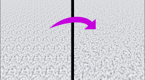

# Voronoi Texture Scattering



Voronoi texture scattering works by distributing small uvs based on a voronoi texture. Because of this, it breaks up repeating artifacts caused by tiling seamless textures. Unfortunately, it does create seams, though they are largely unnoticable on textures designed to be seamless.

## Usage

This plugin is a gdshaderinc file. It is configured by using defines. It's designed to be easy to convert a `ShaderMaterial3D` to a gdshader and add scattering. Simply add `VORONOI_INIT` at the beginning of the fragment shader and replace calls to `texture(t, uv)` with `VORONOI_TEXTURE_SAMPLE(t)`. If using a normal map, replace the texture call with `VORONOI_NORMAL_TEXTURE_SAMPLE`. That function handles rotating the normal map so that it is oriented correctly.

### Options

#### `BASE_SCALE`

The base scale of everything.

#### `VORONOI_SCALE`

The scale of the uvs in the cells.

#### `VORONOI_ROTATION`

Rotates the texture randomly up to this value.

#### `VORONOI_SCALE_RANDOM`

Randomly scales the texture based on this value. 0 scale is equivalent to no change.

### Example

```glsl
shader_type spatial;

#define BASE_SCALE 10.0
#define VORONOI_SCALE 1.5
#define VORONOI_ROTATION PI * 2.0
#define VORONOI_SCALE_RANDOM 0.5

#include "res://addons/voronoi_scatter/voronoi.gdshaderinc"

uniform sampler2D texture_albedo : source_color;
uniform sampler2D texture_roughness : hint_roughness_r;
uniform sampler2D texture_normal : filter_linear_mipmap;

void fragment() {
	VORONOI_INIT

	ALBEDO = VORONOI_TEXTURE_SAMPLE(texture_albedo).rgb;
	ROUGHNESS = VORONOI_TEXTURE_SAMPLE(texture_roughness).r;
	NORMAL_MAP = VORONOI_NORMAL_TEXTURE_SAMPLE(texture_normal);
}
```
